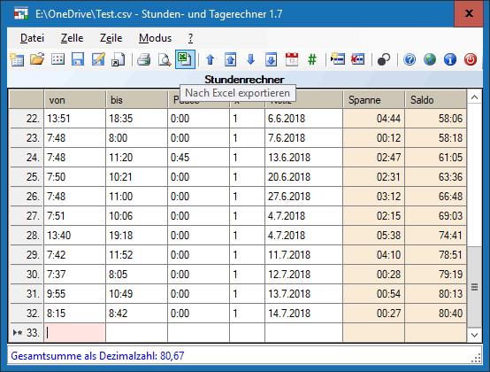

# TimeCalc - Stunden- und Tagerechner

Die Software funktioniert wie eine für die Zeiterfassung optimierte Tabellenkalkulation. Sie ist auf maximale Bedienungsfreundlichkeit getrimmt.

Arbeitsstunden innerhalb einer Woche, Überstunden in einem Monat und andere Zeitspannen lassen sich mit diesem Programm mühelos zusammenrechnen - sogar für mehrere Personen.

Die Software funktioniert wie eine für die Zeiterfassung optimierte Tabellenkalkulation. Sie ist auf maximale Bedienungsfreundlichkeit getrimmt. Zum Beispiel können Daten verkürzt eingegeben oder durch Drücken der Plus- bzw. Minustaste verändert werden.

Die Tabelle kann gespeichert werden. Durch Anlegen einer entsprechenden Verknüpfung ist es auch möglich, das Programm mit gespeicherten Werten zu starten und diese fortzuschreiben.

Ab Version 1.7 ist es einfach möglich Daten aus der vom [Bundesministerium für Arbeit und Soziales (BMAS) kostenlos angebotenen Zeiterfassungs-App "einfach erfasst"](https://www.bmas.de/DE/Themen/Arbeitsrecht/Mindestlohn/mindestlohn-app-einfach-erfasst.html) zu importieren. Dadurch empfiehlt sich das Programm als Analyse- und Archivierungs-Tool der per App gesammelten Daten.

**Download:** [https://github.com/ophthalmos/TimeCalc/releases](https://github.com/ophthalmos/TimeCalc/releases)
